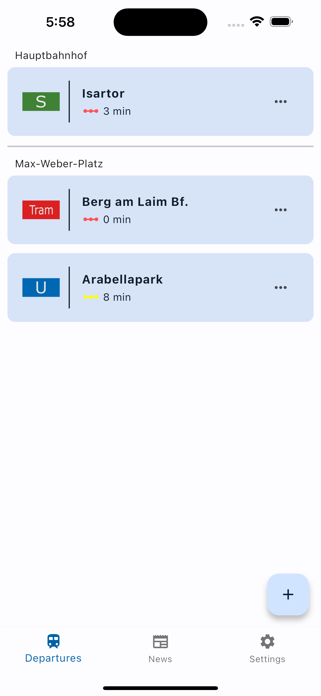
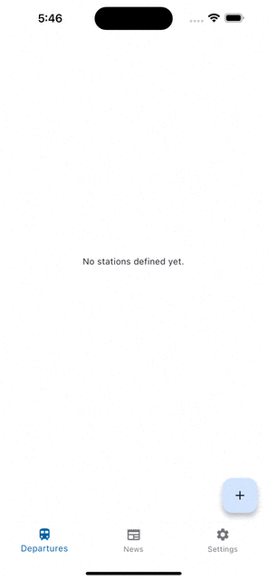

# TrackYourStop
TrackYourStop is an open-source project designed to help you easily track the departure times of local public transportation lines and stay updated with current news. Whether you rely on buses, trams, trains, or other forms of public transportation, this application aims to make your commute more convenient.

<p align="center">
  
</p>

## Supported Commutes
- MVV

## Tech-Stack
- **Flutter**
- **Dart**

## Features
- **Track your favorite connections**: Choose your preferred public transportation lines by specifying the origin and target so you always see the right connection in one click.
- **Delays**: Get real-time information on the next departures for your selected lines.
- **News Integration**: Stay informed with the latest news relevant to your region or city.
- **Localizations**: Supports translations for
  - English(default) 100%
  - German 100%
  - Croatian 100%

## Getting Started
Follow these steps to get started with TrackYourStop:

  1. **Clone the Repository**:
     
    `git clone https://github.com/bremade/TrackYourStop`
    
    `cd TrackYourStop`
    
  2. **Install prerequisites**:
  Ensure you have the necessary dependencies installed.
  
  ```bash
  # Install dependencies
  flutter pub get
  # Generate routes
  dart run build_runner build
  # Generate localizations
  flutter gen-l10n
  ```
  3. **Run the App**

## Usage
### Add favorite
Choose your preferred public transportation lines by specifying the origin and target so you always see the right connection in one click.
#### Demo

   
### Settings
#### Common
- Switch theme to dark/light
- Language is dependent on your device language. English as default
#### Departures
- Adapt the amount of concurrent departures for one line are displayed
#### News
- Define if all news including planned issues should be displayed
- Define if the news should only be displayed that are affecting the lines you defined as a favorite
#### Demo


## Contributing
We welcome contributions from the open-source community to make this project even better. To contribute, follow these steps:

1. Fork the repository on GitHub.
2. Create a new branch for your feature or bug fix:
   
   `git checkout -b feature/your-feature-name`
3. Make your changes and commit them with clear and concise messages:

   `git commit -m "Add feature/fix for XYZ"`
4. Push your changes to your fork on GitHub:

   `git push origin feature/your-feature-name`
5. Create a pull request to the main repository.
6. We will review your changes and merge them if they align with the project's goals.

## License
This project is licensed under the Apache 2.0 License - see the [LICENSE](LICENSE) file for details.

## Good to know
The APIs used are completely unofficial and were jetzt reverse engineered by me. Thats why there is no documentation for it.
Usage could be revoked at any given time.
